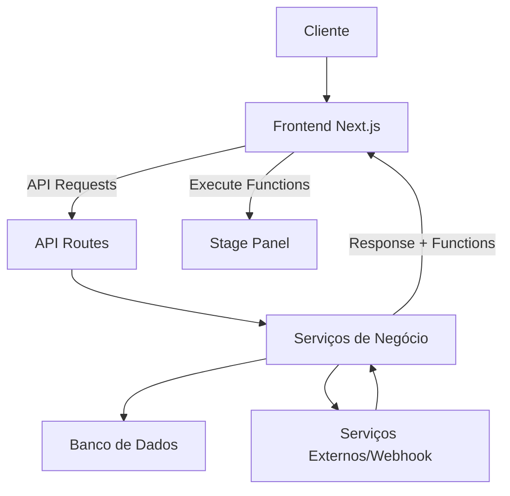
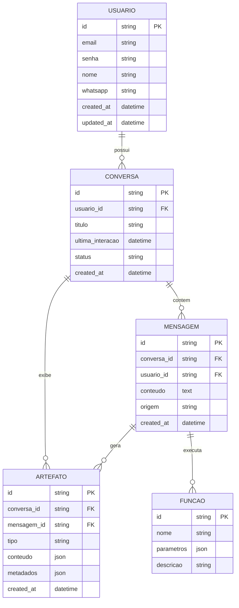
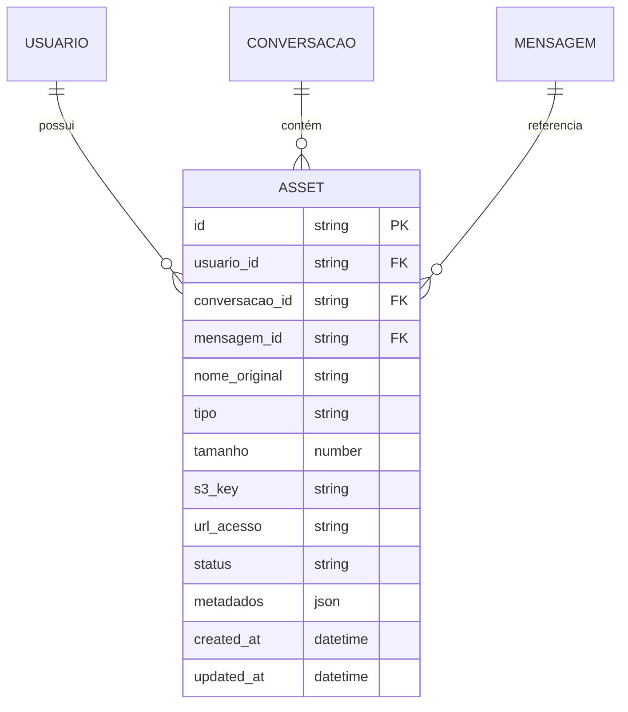

# PROJETO EXECUTIVO

> Este documento serve como fonte central de verdade e registro histórico de desenvolvimento do projeto. Cada nova etapa de desenvolvimento deve ser documentada como uma nova seção datada, sem modificar ou remover seções anteriores.

## Índice
1. [Visão Geral](#visão-geral)
2. [Stack Tecnológico](#stack-tecnológico)
3. [Arquitetura](#arquitetura)
4. [Estrutura do Projeto](#estrutura-do-projeto)
5. [Banco de Dados](#banco-de-dados)
6. [Autenticação e Autorização](#autenticação-e-autorização)
7. [APIs e Integrações](#apis-e-integrações)
8. [Plano de Implementação](#plano-de-implementação)
9. [Glossário](#glossário)
10. [Histórico de Desenvolvimento](#histórico-de-desenvolvimento)
11. [Layout do Dashboard](#layout-do-dashboard)
12. [Gerenciamento de Assets](#gerenciamento-de-assets)

## Visão Geral

### Propósito do Projeto
O projeto consiste em uma solução de dashboard interativo baseado no layout da Claude AI, que gira em torno de um chat com possibilidades interativas avançadas. A solução busca resolver desafios de experiência do usuário ao multiplicar as possibilidades de experiências guiadas por meio de um sistema flexível de visualizações e interações.

### Objetivos
- Criar uma interface de usuário inspirada no Claude AI, com três painéis principais (sidebar, chat e stage)
- Implementar um sistema flexível para execução de funções recebidas via API no painel Stage
- Oferecer uma experiência de usuário moderna e adaptável a diferentes casos de uso
- Facilitar a integração com serviços externos via API para processamento de mensagens
- Garantir segurança e escalabilidade na solução

### Requisitos Principais
- Dashboard responsivo com layout inspirado no Claude AI
- Autenticação de usuários com cadastro de número de WhatsApp
- Integração com webhook externo (configurável) para processamento de mensagens
- Sistema de execução dinâmica de funções no painel Stage
- Suporte a múltiplos tipos de visualização (formulários, imagens, vídeos, listas)
- Tema dark como padrão
- Fácil configuração com banco de dados MySQL ou PostgreSQL/Supabase

### Público-alvo
Organizações e desenvolvedores que buscam uma plataforma flexível para criar experiências guiadas por chat, com possibilidade de mostrar diferentes conteúdos e interações baseados nas solicitações dos usuários, proporcionando uma experiência similar a assistentes virtuais avançados.

## Stack Tecnológico

### Frontend
- **Framework**: Next.js 14, React 18
- **Linguagem**: TypeScript 5.2
- **Estilização**: TailwindCSS 3.4, Shadcn/UI
- **Gerenciamento de Estado**: Zustand
- **Renderização**: App Router, Server Components
- **UI/UX**: Framer Motion para animações, Radix UI para componentes acessíveis

### Backend
- **Runtime**: Node.js 20.x
- **Framework**: Next.js API Routes
- **API**: REST
- **Validação**: Zod
- **Autenticação**: NextAuth.js / Auth.js

### Banco de Dados
- **Principal**: PostgreSQL 15 (com opção alternativa para MySQL 8)
- **ORM**: Prisma
- **Migrations**: Prisma Migrate
- **Hospedagem**: Supabase (opcional)

### Infraestrutura
- **Hospedagem**: Vercel
- **CI/CD**: GitHub Actions
- **Storage**: Vercel Blob Storage / AWS S3 (opcional)

### Ferramentas de Desenvolvimento
- **Linting/Formatting**: ESLint, Prettier
- **Testing**: Jest, React Testing Library, Playwright
- **Build**: Turbopack
- **Package Manager**: pnpm

### Justificativas Técnicas
O conjunto de tecnologias escolhido prioriza desenvolvimento rápido, performance e manutenibilidade:

- **Next.js e React**: Oferece renderização híbrida (SSR/CSR) e otimizações automáticas para melhor performance e SEO
- **TypeScript**: Proporciona tipagem estática para reduzir erros em tempo de desenvolvimento e melhorar a manutenibilidade
- **TailwindCSS e Shadcn/UI**: Permite desenvolvimento rápido de interfaces com design consistente
- **Zustand**: Gerenciador de estado leve e de fácil implementação, adequado para a complexidade do projeto
- **Prisma**: ORM tipado que facilita interações seguras com banco de dados e migrations
- **Zod**: Validação de esquemas com inferência de tipos TypeScript
- **Vercel**: Plataforma com CI/CD integrado, otimizada para Next.js

## Arquitetura

### Visão Geral da Arquitetura
O sistema segue uma arquitetura de três camadas principais: cliente (frontend), servidor (backend) e banco de dados. O frontend é organizado em três painéis principais (Sidebar, Chat e Stage) que se comunicam com o backend via API. O backend processa as solicitações do usuário, interage com serviços externos quando necessário, e retorna respostas formatadas que podem incluir funções a serem executadas no painel Stage.

### Diagrama de Arquitetura


### Fluxos Principais

#### Fluxo de Autenticação
1. Usuário acessa a plataforma
2. Insere credenciais (email/senha) e número de WhatsApp (formato +5511988887777)
3. Backend valida credenciais e salva os dados
4. Token JWT é gerado e armazenado como cookie
5. Usuário é redirecionado para o dashboard

#### Fluxo de Gerenciamento de Conversas
1. Cada usuário possui seu próprio histórico de conversas
2. As conversas são listadas na Sidebar, ordenadas por data de última interação
3. Usuário pode criar uma nova conversa a qualquer momento
4. Usuário pode pesquisar, filtrar, marcar como favorito ou excluir conversas
5. Ao selecionar uma conversa, o Chat é carregado com o histórico de mensagens
6. As conversas associadas ao usuário persistem entre sessões

#### Fluxo de Interação
1. Usuário envia mensagem pelo Chat
2. Mensagem é enviada para o webhook (endpoint externo configurado durante a instalação do sistema)
3. O webhook processa a mensagem e retorna um JSON estruturado contendo:
   - Mensagem de resposta para o usuário (exibida no Chat)
   - Função a ser executada (opcional)
   - Parâmetros da função (opcional)
4. Frontend exibe a resposta no Chat
5. Se o JSON contiver uma função com parâmetros, ela é executada no Stage
6. O Stage renderiza o conteúdo apropriado (formulário, imagem, vídeo, lista, etc.)
7. Cada conversa pode conter múltiplos artefatos no Stage, que são persistidos e podem ser revisitados

### Componentes do Sistema

#### Frontend
- **Sidebar**: Componente expansível (20% da largura) com logo, menu, histórico personalizado de conversas do usuário e, na parte inferior, informações do usuário e botão de logout
- **Chat**: Área central (40% da largura) para interação via mensagens de texto
- **Stage**: Área dinâmica (40% da largura) para exibição de conteúdos interativos, permitindo múltiplos artefatos por conversa
- **Função Executor**: Sistema responsável por interpretar e executar as funções recebidas da API
- **Gerenciador de Conversas**: Componente que permite ao usuário criar, selecionar, pesquisar e excluir conversas

#### Backend
- **API Routes**: Endpoints para autenticação, processamento de mensagens e integração com serviços externos
- **Controladores**: Lógica para gerenciar as requisições e respostas
- **Serviços**: Lógica de negócio e comunicação com banco de dados
- **Middlewares**: Validação, autenticação e autorização
- **Gerenciador de Artefatos**: Componente responsável pelo armazenamento e recuperação de artefatos associados às conversas

### Considerações de Segurança
- Implementação de autenticação JWT
- Validação de entradas com Zod
- Sanitização de dados para prevenir XSS
- CSRF protection
- Rate limiting para prevenir abusos
- Armazenamento seguro de credenciais

### Considerações de Escalabilidade
- Separação clara entre frontend e backend permitindo escala independente
- Otimização de componentes React para renderização eficiente
- Estratégias de cache para reduzir carga no servidor
- Pagination em APIs que retornam grandes volumes de dados
- Design de banco de dados otimizado para consultas frequentes

## Estrutura do Projeto

### Diretórios Principais
```
dashboard/
├── src/
│   ├── app/              # Rotas e páginas (Next.js App Router)
│   │   ├── api/          # API Routes
│   │   ├── auth/         # Rotas de autenticação
│   │   ├── dashboard/    # Página principal do dashboard
│   │   └── (...)         # Outras rotas
│   ├── components/       # Componentes React reutilizáveis
│   │   ├── ui/           # Componentes de UI básicos
│   │   ├── sidebar/      # Componentes da Sidebar
│   │   ├── chat/         # Componentes do Chat
│   │   ├── stage/        # Componentes do Stage
│   │   └── layouts/      # Layouts compartilhados
│   ├── lib/              # Bibliotecas e utilitários
│   │   ├── auth/         # Utilitários de autenticação
│   │   ├── api/          # Cliente API e fetchers
│   │   └── validators/   # Esquemas de validação
│   ├── hooks/            # React hooks customizados
│   ├── context/          # Contextos React
│   ├── store/            # Stores Zustand
│   ├── services/         # Serviços de negócio
│   │   ├── chat/         # Serviços relacionados ao chat
│   │   ├── stage/        # Serviços relacionados ao stage
│   │   └── user/         # Serviços relacionados ao usuário
│   ├── types/            # Tipos e interfaces TypeScript
│   ├── styles/           # Estilos globais
│   └── utils/            # Funções utilitárias
├── public/               # Arquivos estáticos
├── prisma/               # Esquema do banco de dados e migrações
│   ├── schema.prisma     # Definição do esquema Prisma
│   └── migrations/       # Migrações geradas
├── tests/                # Testes
│   ├── unit/             # Testes unitários
│   ├── integration/      # Testes de integração
│   └── e2e/              # Testes end-to-end
├── scripts/              # Scripts utilitários
└── docs/                 # Documentação adicional
```

### Propósito dos Diretórios

#### src/app
Contém as rotas e páginas da aplicação, seguindo a estrutura do App Router do Next.js 14. Cada subdiretório representa uma rota, com arquivos como `page.tsx`, `layout.tsx` e `loading.tsx`.

#### src/components
Componentes React reutilizáveis, organizados por domínio e funcionalidade:
- **ui/**: Componentes de UI básicos como botões, inputs, modais
- **sidebar/**: Componentes específicos da sidebar
- **chat/**: Componentes relacionados à área de chat
- **stage/**: Componentes para o painel Stage e renderização dinâmica
- **layouts/**: Layouts compartilhados entre múltiplas páginas

#### src/lib
Bibliotecas e utilitários compartilhados, como configurações, clientes de API e validadores.

#### src/hooks
React hooks customizados para lógica reutilizável, como `useChat`, `useStage`, etc.

#### src/context
Contextos React para compartilhamento de estado global na aplicação.

#### src/store
Stores Zustand para gerenciamento de estado, organizados por domínio.

#### src/services
Lógica de negócio e serviços da aplicação, como comunicação com APIs externas.

#### src/types
Definições de tipos e interfaces TypeScript compartilhadas.

### Convenções de Nomenclatura
- **Arquivos**: kebab-case para arquivos de componentes, utils e hooks
- **Componentes**: PascalCase para componentes React
- **Funções**: camelCase para funções e métodos
- **Tipos/Interfaces**: PascalCase para tipos e interfaces, com prefixo "I" para interfaces (ex: IUserData)
- **Constantes**: UPPER_SNAKE_CASE para constantes
- **Eventos**: Funções de manipulação de eventos devem ser prefixadas com "handle" (ex: handleSubmit)

### Padrões de Implementação
- **Componentes**: Uso de componentes funcionais com hooks
- **Props**: Tipagem explícita de props com TypeScript
- **Responsabilidade**: Componentes devem ter responsabilidade única
- **Estado**: Uso de Zustand para estado global, useState para estado local
- **Efeitos**: Uso criterioso de useEffect com dependências explícitas
- **Renderização Condicional**: Uso de operadores ternários para renderização condicional simples, ou early return para casos complexos

## Banco de Dados

### Modelo de Dados
O banco de dados armazena informações sobre usuários, mensagens do chat, e configurações do sistema.

### Diagrama ER


### Estratégia de Migração
1. Uso do Prisma Migrate para gerenciamento de migrações
2. Migrations são versionadas e rastreadas no controle de versão
3. Scripts de seed para dados iniciais
4. Estratégia de rollback para casos de falha

### Índices e Otimizações
- Índice em usuário.email para pesquisa rápida
- Índice em usuário.whatsapp para pesquisa rápida
- Índice em mensagem.usuario_id para relacionamentos
- Índice composto em mensagem (usuario_id, created_at) para consultas ordenadas

## Autenticação e Autorização

### Fluxo de Autenticação
1. Registro de usuário com e-mail, senha e número de WhatsApp
2. Cadastro do número de WhatsApp no formato padronizado (+5511988887777)
3. Armazenamento seguro das credenciais (senha hash+salt)
4. Login com email e senha
5. Geração de token JWT com expiração
6. Armazenamento do token em cookie HTTP-only

### Gestão de Sessões
- Tokens JWT para autenticação stateless
- Refresh tokens para renovação de sessão
- Expiração configurável de tokens
- Invalidação de sessão no logout

### Perfis e Permissões
- Usuário padrão: acesso às funcionalidades básicas
- Administrador: acesso a configurações avançadas e gestão de usuários
- Permissões granulares para acesso a diferentes funcionalidades

### Segurança
- Senhas armazenadas com bcrypt (hash+salt)
- Tokens JWT com assinatura e expiração
- CSRF protection
- Rate limiting em endpoints de autenticação
- Validação rigorosa de entradas
- Proteção contra brute force

## APIs e Integrações

### APIs Internas
- **/api/auth**: Endpoints de autenticação (registro, login, logout)
- **/api/messages**: Envio e recebimento de mensagens
- **/api/stage**: Gestão de funções e conteúdo do Stage
- **/api/users**: Gestão de usuários

### Integrações Externas
- Webhook configurável para processamento de mensagens (configurado durante a instalação do sistema)
- Serviços de armazenamento para mídia (imagens, vídeos)
- Integrações com APIs de terceiros conforme necessidade

### Contratos de API

#### Envio de Mensagem (POST /api/messages)
```typescript
// Request
interface SendMessageRequest {
  content: string;
}

// Response
interface SendMessageResponse {
  id: string;
  content: string;
  timestamp: string;
  reply: {
    content: string;
    function?: {
      name: string;
      parameters: Record<string, any>;
    }
  }
}
```

#### Execução de Função (POST /api/stage/execute)
```typescript
// Request
interface ExecuteFunctionRequest {
  functionName: string;
  parameters: Record<string, any>;
}

// Response
interface ExecuteFunctionResponse {
  success: boolean;
  result: any;
  error?: string;
}
```

### Estratégia de Versionamento
- Versionamento via URL (/api/v1/...)
- Documentação clara de breaking changes
- Período de deprecação para versões antigas
- Testes automáticos para garantir compatibilidade

## Plano de Implementação

### Fases do Projeto

#### Fase 1: Fundação
- Configuração inicial do projeto
- Implementação da estrutura básica do frontend
- Configuração do banco de dados e ORM
- Implementação do sistema de autenticação

#### Fase 2: Componentes Principais
- Desenvolvimento do layout base (Sidebar, Chat, Stage)
- Implementação da lógica básica de chat
- Sistema de roteamento e navegação
- Dashboard responsivo

#### Fase 3: Integração e Funcionalidades Avançadas
- Implementação do sistema de execução de funções no Stage
- Integração com APIs externas
- Desenvolvimento dos visualizadores dinâmicos (formulários, listas, etc.)
- Polimento da UI/UX

#### Fase 4: Testes e Otimização
- Testes abrangentes (unidade, integração, e2e)
- Otimização de performance
- Resolução de bugs
- Documentação

### Ordem de Implementação
1. Configuração do projeto e ambiente de desenvolvimento
2. Estrutura de diretórios e arquivos base
3. Configuração do banco de dados e migrations iniciais
4. Implementação do sistema de autenticação
5. Desenvolvimento do layout base e componentes UI
6. Implementação do sistema de chat básico
7. Desenvolvimento do sistema de execução de funções no Stage
8. Integração com APIs externas
9. Implementação de visualizadores dinâmicos
10. Testes, otimização e documentação

### Dependências entre Componentes
- Sistema de autenticação precisa estar implementado antes do chat
- Backend de processamento de mensagens precisa estar funcional antes da implementação do Stage
- Sistema de execução de funções precisa estar implementado antes dos visualizadores dinâmicos

### Milestones
1. **Setup Inicial**: Projeto configurado, estrutura definida, banco de dados conectado
2. **MVP de Autenticação**: Registro e login funcionais
3. **Layout Base**: Implementação dos três painéis principais
4. **Chat Funcional**: Envio e recebimento de mensagens
5. **Stage Básico**: Execução de funções simples
6. **Visualizadores**: Implementação de diferentes visualizadores no Stage
7. **MVP Completo**: Sistema funcional com todas as funcionalidades básicas
8. **Versão 1.0**: Sistema polido, testado e documentado

## Glossário

| Termo | Definição |
|-------|-----------|
| Sidebar | Painel lateral (20% da largura) contendo logo, menu, histórico personalizado de conversas, dados do usuário e botão de logout |
| Chat | Painel central (40% da largura) para interação via mensagens |
| Stage | Painel direito (40% da largura) para exibição de conteúdos interativos gerados dinamicamente, suportando múltiplos artefatos por conversa |
| Conversa | Sessão de interação entre usuário e sistema, composta por mensagens e artefatos associados |
| Artefato | Conteúdo interativo gerado no Stage a partir de funções executadas, persistido e associado a uma conversa específica |
| Função | Código executável com parâmetros que é enviado pela API e executado no Stage |
| Webhook | Endpoint externo que processa mensagens e retorna respostas estruturadas |
| Visualizador | Componente do Stage responsável por renderizar diferentes tipos de conteúdo (formulários, imagens, vídeos, etc.) |
| Asset | Arquivo enviado pelo usuário (PDF, imagem, vídeo, etc.) armazenado no S3 e referenciado no banco de dados |

## Layout do Dashboard

### Visão Geral do Layout
O layout do dashboard replica com precisão a experiência visual e interativa do Claude AI, dividido em três painéis principais com proporções definidas:

- **Sidebar**: 20% da largura total
- **Chat**: 40% da largura total 
- **Stage**: 40% da largura total

Este design mantém a familiaridade para usuários do Claude AI enquanto permite a adição de funcionalidades personalizadas adaptadas às necessidades específicas do projeto.

### Características Principais

#### Estado Inicial
- **Sidebar e Stage**: Inicialmente carregam recolhidos para maximizar o espaço disponível para o Chat
- **Ícones de Expansão**: Botões intuitivos em formato de seta ou hambúrguer permitem expandir cada painel
- **Expansão Automática**: Quando uma função é retornada pelo webhook, o Stage expande automaticamente para exibir o conteúdo correspondente

#### Tema e Estética
- **Tema Dark**: Utiliza o mesmo esquema de cores do Claude AI, com fundo escuro e elementos de UI em tons de cinza e azul-marinho
- **Paleta de Cores**: 
  - Fundo principal: #0C0E10 (quase preto)
  - Elementos de fundo secundário: #1A1D21 (cinza muito escuro)
  - Texto primário: #FFFFFF (branco)
  - Texto secundário: #8E8E8F (cinza claro)
  - Acentos/Destaques: #5D63F1 (azul-violeta)
  - Elementos interativos: variações de #5D63F1
- **Tipografia**: Fonte sans-serif moderna, com espaçamento e hierarquia similares ao Claude AI
- **Elevação e Sombras**: Sutis indicações de elevação usando sombras leves para distinguir elementos sobrepostos

#### Animações
- **Transições Suavizadas**: Todas as interações (expandir/recolher painéis, aparecimento de mensagens, carregamento de conteúdo no Stage) têm animações suaves usando Framer Motion
- **Durações**: Animações entre 150-300ms para manter o equilíbrio entre suavidade e desempenho
- **Curvas de Easing**: Utilização de curvas de aceleração natural (ease-in-out) para movimentos de elementos

### Detalhes dos Painéis

#### Sidebar (20% da largura)
O sidebar replica fielmente a estrutura do Claude AI:

- **Topo**:
  - Logo da aplicação (similar ao posicionamento do logo Claude)
  - Botão "Nova Conversa" com ícone + para iniciar novas interações

- **Centro**:
  - Lista de conversas anteriores organizadas por data
  - Cada item mostra título/preview da conversa com timestamp
  - Scroll vertical quando necessário
  - Opção de pesquisar conversas anteriores

- **Parte Inferior**:
  - Informações do usuário logado (nome e avatar) alinhados à esquerda
  - Botão "Sair" alinhado à direita
  - Fina linha separadora acima deste rodapé

- **Estados Colapsados**:
  - Quando recolhido, exibe apenas ícones de navegação centralizados
  - Ícone de expansão claramente visível no topo

#### Chat (40% da largura)
O painel central de interação:

- **Cabeçalho**:
  - Título da conversa atual
  - Informação de timestamp discreto
  - Botões de ação (compartilhar, configurações)

- **Área de Mensagens**:
  - Bolhas de mensagem claramente distintas entre usuário e sistema
  - Mensagens do usuário alinhadas à direita com fundo mais escuro
  - Mensagens do sistema alinhadas à esquerda com fundo ligeiramente mais claro
  - Indicador de digitação animado quando o sistema está processando
  - Timestamps discretos em mensagens
  - Scroll suave mantendo a última mensagem visível

- **Área de Entrada**:
  - Campo de texto expansível
  - Botão de envio com animação de estado
  - Indicação visual do limite de caracteres
  - Suporte a formatação básica (opcional)

#### Stage (40% da largura)
Painel de visualização dinâmica:

- **Cabeçalho**:
  - Título da função/visualização atual
  - Botões de ação contextual (fechar, minimizar, exportar)
  - Indicador do tipo de visualização

- **Área de Conteúdo**:
  - Espaço flexível para renderização de diferentes tipos de conteúdo
  - Sistema de tabs quando múltiplas visualizações estão ativas
  - Estilos consistentes para diferentes tipos de visualizadores
  - Scroll independente quando necessário

- **Estados Colapsados**:
  - Quando recolhido, pode mostrar preview mínimo ou notificação de conteúdo disponível
  - Ícone de expansão claramente visível

### Responsividade
- **Desktop**: Layout completo com os três painéis lado a lado nas proporções definidas
- **Tablet**: Os painéis podem recolher automaticamente, priorizando o chat, com gestos de deslize para revelar sidebar ou stage
- **Mobile**: Visualização em tela cheia de um painel por vez, com navegação por abas ou deslize entre painéis

### Acessibilidade
- Contraste adequado entre texto e fundo
- Tamanhos de fonte ajustáveis
- Suporte completo a navegação por teclado
- Aria-labels em todos os elementos interativos
- Suporte a leitores de tela

## Gerenciamento de Assets

### Visão Geral
O sistema permite que os usuários enviem diversos tipos de arquivos (PDFs, planilhas, imagens, vídeos, etc.) como parte da experiência interativa. Estes assets são armazenados em um bucket S3 na AWS, enquanto apenas os metadados e URLs de referência são armazenados no banco de dados, otimizando a performance e escalabilidade da aplicação.

### Arquitetura de Armazenamento

#### Fluxo de Upload
1. Usuário seleciona ou arrasta um arquivo para o Chat ou para uma interface específica no Stage
2. Frontend realiza validação inicial (tamanho, tipo de arquivo, potenciais riscos)
3. Frontend solicita URL de upload pré-assinada ao Backend
4. Backend gera URL pré-assinada com tempo de expiração para upload direto ao S3
5. Frontend realiza upload diretamente para o S3 usando a URL pré-assinada
6. Após upload bem-sucedido, Backend salva metadados e URL de acesso no banco de dados
7. Asset fica disponível para referência nas conversas e para processamento

#### Estrutura no S3
```
s3://dashboard-assets-bucket/
├── user-<user_id>/                # Separação por usuário
│   ├── <conversation_id>/         # Agrupamento por conversa
│   │   ├── <timestamp>-<hash>/    # Identificador único do upload
│   │   │   ├── original/          # Arquivo original
│   │   │   └── processed/         # Versões processadas (thumbnails, etc.)
```

### Tipos de Assets Suportados

| Tipo | Extensões | Limite de Tamanho | Processamento |
|------|-----------|-------------------|---------------|
| Documentos | .pdf, .doc, .docx, .txt | 20MB | Extração de texto, preview |
| Planilhas | .xls, .xlsx, .csv | 15MB | Parsing, visualização tabular |
| Imagens | .jpg, .png, .gif, .webp | 10MB | Compressão, thumbnails |
| Vídeos | .mp4, .webm | 100MB | Transcodificação, thumbnails |
| Áudio | .mp3, .wav, .ogg | 30MB | Transcodificação, waveform |

### Modelo de Dados



### Segurança e Permissões

#### Políticas de Acesso
- Assets são acessíveis apenas pelo usuário que os enviou
- URLs de acesso são assinadas e expiram após período configurável
- Políticas de Bucket S3 restritas para evitar acesso não autorizado
- Possibilidade de configurar período de retenção por tipo de arquivo

#### Validação e Sanitização
- Verificação de tipos MIME reais dos arquivos (não apenas extensão)
- Scan de malware/vírus em assets enviados
- Remoção de metadados sensíveis de imagens (EXIF, GPS, etc.)
- Limite de uploads por período para prevenir abusos

### APIs para Gerenciamento de Assets

#### Obter URL de Upload (GET /api/assets/upload-url)
```typescript
// Request
interface GetUploadUrlRequest {
  fileName: string;
  fileType: string;
  fileSize: number;
  conversationId: string;
}

// Response
interface GetUploadUrlResponse {
  uploadUrl: string;
  assetId: string;
  expiresAt: string;
}
```

#### Confirmação de Upload (POST /api/assets/confirm)
```typescript
// Request
interface ConfirmUploadRequest {
  assetId: string;
  success: boolean;
  metadados?: Record<string, any>;
}

// Response
interface ConfirmUploadResponse {
  asset: {
    id: string;
    url: string;
    status: 'active' | 'processing' | 'error';
  }
}
```

### Integração com o Chat e Stage

- Chat permite arrastar e soltar arquivos ou selecionar via botão
- Stage pode renderizar previews ou visualizadores específicos por tipo de arquivo
- Funções específicas disponíveis para manipulação de assets (ex: extrair texto de PDFs, analisar planilhas)
- Interface para gerenciamento de assets enviados na conversa atual
- Referências a assets permanecem funcionais em histórico de conversas

### Considerações de Performance

- Upload direto para S3 (browser → S3) sem passar pelo servidor
- Processamento assíncrono de arquivos grandes
- Geração lazy de thumbnails e previews
- Técnicas de compressão para otimizar armazenamento
- Configuração de Cache-Control para assets frequentemente acessados

### Limitações e Monitoramento

- Cotas de uso por usuário/organização
- Monitoramento de uso de armazenamento
- Alertas automáticos para uso excessivo
- Políticas de lifecycle para arquivos temporários

## Histórico de Desenvolvimento

> Esta seção mantém um registro cronológico do desenvolvimento. Cada nova entrada deve ser adicionada no TOPO, sem modificar entradas anteriores.

### [04/04/2025] - Atualização da Estrutura de Conversas e Artefatos

#### O que foi implementado
Atualização do modelo de dados e da arquitetura do sistema para acomodar o gerenciamento personalizado de conversas por usuário e o suporte a múltiplos artefatos por conversa no Stage.

#### Como foi implementado
Foram realizadas modificações significativas na estrutura do projeto:
- Adicionado modelo de dados para Conversas como entidade central
- Implementado relacionamento entre Usuários, Conversas, Mensagens e Artefatos
- Atualizado diagrama ER para refletir a nova estrutura de dados
- Refinado o fluxo de interação para incluir o gerenciamento de conversas
- Detalhado o sistema de navegação e persistência de artefatos no Stage
- Expandido o Sidebar para suportar gerenciamento de conversas personalizado

#### Decisões tomadas
1. **Modelo Hierárquico**: Implementação de uma estrutura hierárquica onde usuários possuem conversas, conversas contêm mensagens, e mensagens podem gerar artefatos.

2. **Artefatos Persistentes**: Os artefatos no Stage serão persistidos e associados às conversas, permitindo que os usuários revisitem análises e visualizações anteriores.

3. **Navegação por Abas no Stage**: Implementação de um sistema de abas/navegação no Stage para permitir que os usuários alternem entre diferentes artefatos gerados na mesma conversa.

4. **Gerenciamento de Conversas**: Adição de funcionalidades completas de gerenciamento (pesquisa, favoritos, arquivamento, exclusão) no Sidebar para dar controle total aos usuários sobre seu histórico.

5. **Indicadores Visuais**: Inclusão de indicadores que mostram quais mensagens geraram artefatos no Stage e quais conversas contêm artefatos.

#### Desafios e soluções
- **Desafio**: Manter a experiência de usuário fluida com múltiplos artefatos no Stage
  **Solução**: Implementação de um sistema de navegação intuitivo com abas e histórico visual

- **Desafio**: Gerenciar eficientemente o ciclo de vida de conversas com múltiplos artefatos associados
  **Solução**: Modelo de dados otimizado com cascata apropriada para exclusões e arquivamento

- **Desafio**: Equilibrar a persistência de artefatos com o uso de recursos
  **Solução**: Estratégia de caching e lazy-loading para artefatos menos utilizados

#### Conexões com outros componentes
- Integração com o sistema de autenticação para associação correta entre usuários e suas conversas
- Relação direta com o sistema de armazenamento de assets para incorporação de arquivos nos artefatos
- Impacto no layout do dashboard, especialmente na estrutura do Sidebar e do Stage
- Afeta as APIs internas para suportar as novas operações de gerenciamento

#### Considerações futuras
- Implementação de funcionalidades colaborativas para compartilhamento de conversas e artefatos entre usuários
- Exportação de conversas completas incluindo artefatos associados
- Sistema avançado de categorização e organização do histórico de conversas
- Análise de uso para recomendações personalizadas de conversas anteriores

### [04/04/2025] - Implementação do Sistema de Gerenciamento de Assets

#### O que foi implementado
Definição da estrutura completa do sistema de gerenciamento de assets enviados pelo usuário, incluindo fluxo de upload, armazenamento no S3 AWS, modelo de dados e APIs necessárias para integração com o dashboard.

#### Como foi implementado
Foi elaborada uma especificação detalhada abordando:
- Arquitetura de armazenamento utilizando AWS S3 como repositório principal
- Fluxo completo de upload com URLs pré-assinadas para upload direto
- Estrutura organizada de armazenamento no bucket S3
- Modelo de dados para referência de assets no banco de dados
- Tipos de arquivos suportados com limites e processamentos específicos
- Políticas de segurança e permissões para proteção dos assets
- APIs para gerenciamento de uploads e acesso aos assets
- Integração com os componentes Chat e Stage para experiência fluida

#### Decisões tomadas
1. **Armazenamento em S3**: Optou-se pelo AWS S3 como solução de armazenamento devido à sua escalabilidade, durabilidade e integração nativa com serviços AWS.

2. **Upload Direto para S3**: Implementação de upload direto do navegador para o S3 usando URLs pré-assinadas, evitando sobrecarga no servidor e melhorando a experiência do usuário.

3. **Estrutura Hierárquica**: Organização dos assets por usuário e conversa, facilitando gerenciamento, backup e aplicação de políticas de acesso.

4. **Metadados no Banco de Dados**: Armazenamento apenas de metadados e URLs no banco de dados relacional, mantendo a eficiência das consultas.

5. **Processamento Assíncrono**: Implementação de processamentos específicos por tipo de arquivo (thumbnails, extração de texto) de forma assíncrona.

#### Desafios e soluções
- **Desafio**: Garantir segurança no upload direto para S3
  **Solução**: Implementação de URLs pré-assinadas com tempo de expiração curto e validação rigorosa no frontend e backend

- **Desafio**: Lidar com arquivos de grande porte sem impactar a performance
  **Solução**: Processamento assíncrono e técnicas de streaming para arquivos maiores

- **Desafio**: Manter referências íntegras entre assets e conversas
  **Solução**: Modelo de dados relacional com chaves estrangeiras e políticas de exclusão definidas

#### Conexões com outros componentes
- Integração com o componente Chat para permitir upload de arquivos durante conversas
- Renderização especializada no Stage para diferentes tipos de arquivos
- Conexão com o sistema de autenticação para controle de acesso baseado em usuário
- Associação com modelo de conversas para manter contexto dos uploads

#### Considerações futuras
- Implementação de CDN para assets frequentemente acessados
- Políticas avançadas de retenção e arquivamento
- Expansão dos tipos de visualizadores especializados no Stage
- Funcionalidades de colaboração em torno de assets compartilhados
- Otimizações adicionais de armazenamento para redução de custos

### [04/04/2025] - Detalhamento do Layout do Dashboard

#### O que foi implementado
Definição detalhada do layout do dashboard seguindo a estrutura e estética do Claude AI, estabelecendo diretrizes claras para a implementação visual e interativa dos três painéis principais (Sidebar, Chat e Stage).

#### Como foi implementado
Foi elaborada uma especificação completa do layout, abordando:
- Proporções exatas dos painéis (Sidebar: 20%, Chat: 40%, Stage: 40%)
- Estado inicial colapsado para Sidebar e Stage com mecânica de expansão
- Esquema de cores do tema dark idêntico ao Claude AI
- Sistema de animações suavizadas para transições
- Estrutura detalhada de cada painel, com ênfase na fidelidade visual ao Claude AI
- Considerações sobre responsividade e acessibilidade

#### Decisões tomadas
1. **Estado Inicial Colapsado**: Optou-se por iniciar com Sidebar e Stage colapsados para maximizar o espaço do Chat, melhorando a experiência em dispositivos com telas menores.

2. **Expansão Automática**: Implementação de expansão automática do Stage quando uma função é retornada pelo webhook, garantindo que o conteúdo relevante seja imediatamente visível ao usuário.

3. **Tema Dark por Padrão**: Adoção do tema dark como padrão seguindo a estética do Claude AI, com uma paleta de cores cuidadosamente definida para garantir consistência visual.

4. **Animações Otimizadas**: Definição de durações de animação entre 150-300ms para equilibrar suavidade e responsividade, evitando que transições pareçam lentas ou bruscas.

5. **Layout Responsivo Adaptativo**: Estratégia de adaptação que prioriza o painel mais relevante em cada contexto de uso e tamanho de tela, mantendo a experiência coesa.

#### Desafios e soluções
- **Desafio**: Manter a fidelidade ao layout do Claude AI enquanto adiciona funcionalidades específicas do projeto
  **Solução**: Análise detalhada da UI do Claude, com documentação precisa de proporções, espaçamentos e comportamentos

- **Desafio**: Garantir que a expansão/contração dos painéis seja intuitiva e não desestabilize o layout
  **Solução**: Implementação de transições suaves com Framer Motion e posicionamento fixo dos controles de expansão

- **Desafio**: Adaptação do layout para dispositivos móveis mantendo todas as funcionalidades
  **Solução**: Design de uma estratégia de visualização em tela cheia de um painel por vez com navegação intuitiva entre painéis

#### Conexões com outros componentes
- Integração direta com o sistema de processamento de mensagens, onde respostas do webhook podem acionar a expansão e população do Stage
- Relação com o sistema de autenticação para exibição de informações do usuário no Sidebar
- Interação com o sistema de armazenamento de conversas para popular o histórico no Sidebar

#### Considerações futuras
- Possibilidade de temas personalizáveis além do tema dark padrão
- Opções de acessibilidade avançadas para usuários com necessidades específicas
- Exploração de layouts alternativos para casos de uso especializados
- Adaptações para dispositivos com fatores de forma não convencionais

### [04/04/2025] - Definição Inicial do Projeto

#### O que foi implementado
Criação do Projeto Executivo com base nos requisitos fornecidos, definindo a estrutura, arquitetura e stack tecnológico do dashboard interativo inspirado no layout do Claude AI.

#### Como foi implementado
Foi elaborado um documento detalhado seguindo a estrutura de referência, com foco em cobrir todos os aspectos importantes do projeto:
- Definição clara da visão geral, objetivos e requisitos
- Escolha justificada do stack tecnológico
- Elaboração da arquitetura do sistema com seus principais componentes
- Definição da estrutura de diretórios e padrões de implementação
- Planejamento do modelo de dados e sistema de autenticação
- Especificação de APIs e contratos
- Elaboração do plano de implementação com fases e milestones

#### Decisões tomadas
1. **Stack Tecnológico**: Optou-se por Next.js, React e TypeScript para o frontend, com TailwindCSS e Shadcn/UI para a interface, garantindo desenvolvimento rápido e manutenibilidade. Para o backend, Next.js API Routes foi escolhido para manter a coesão do projeto.

2. **Banco de Dados**: Prisma foi selecionado como ORM para facilitar o trabalho com PostgreSQL/MySQL, oferecendo tipagem forte e migrations gerenciadas.

3. **Arquitetura**: Definiu-se uma arquitetura de três painéis (Sidebar, Chat, Stage) inspirada no layout do Claude AI, com sistema flexível de execução de funções no Stage.

4. **Autenticação**: Implementação baseada em JWT com validação específica para números de WhatsApp no formato requerido.

5. **Sistema de Execução de Funções**: Abordagem modular para permitir a criação de diversos visualizadores no Stage, atendendo à necessidade de experiências interativas ricas.

#### Desafios e soluções
- **Desafio**: Criar um sistema flexível para a execução de funções dinâmicas no Stage
  **Solução**: Arquitetura baseada em plugins/visualizadores que podem ser registrados e invocados conforme necessário

- **Desafio**: Garantir a responsividade considerando os três painéis lado a lado
  **Solução**: Implementação com porcentagens de largura conforme especificado, com comportamento responsivo para dispositivos móveis

#### Conexões com outros componentes
O documento estabelece as bases para todos os componentes do sistema e suas interações, servindo como guia para o desenvolvimento:
- Define a relação entre o Chat e o Stage através do sistema de mensagens e execução de funções
- Estabelece a estrutura da Sidebar e sua integração com o sistema de autenticação
- Detalha as APIs necessárias para a comunicação entre frontend e backend

#### Considerações futuras
- Explorar a possibilidade de uma versão white label do dashboard
- Considerar estratégias para exportação/importação de configurações de funções
- Prever extensibilidade para novos tipos de visualizadores e integrações
- Avaliar a implementação de um marketplace de funções/visualizadores

#### Diagramas atualizados
Foram incluídos diagramas de arquitetura e ER para ilustrar a estrutura do sistema e o modelo de dados.

---

### [DATA] - Inicialização do Projeto

#### O que foi implementado
[Configuração inicial do projeto]

#### Como foi implementado
[Detalhes da inicialização e configuração]

#### Decisões tomadas
[Justificativas para configurações iniciais]

#### Desafios e soluções
[Desafios de configuração e suas soluções]

#### Considerações futuras
[Pontos de atenção para as próximas etapas]